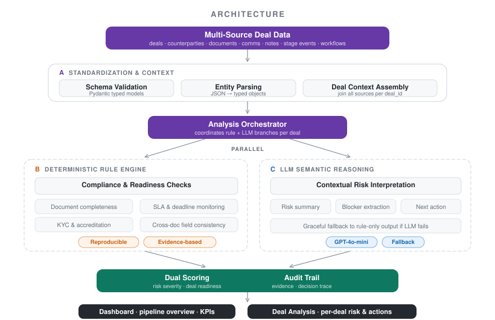
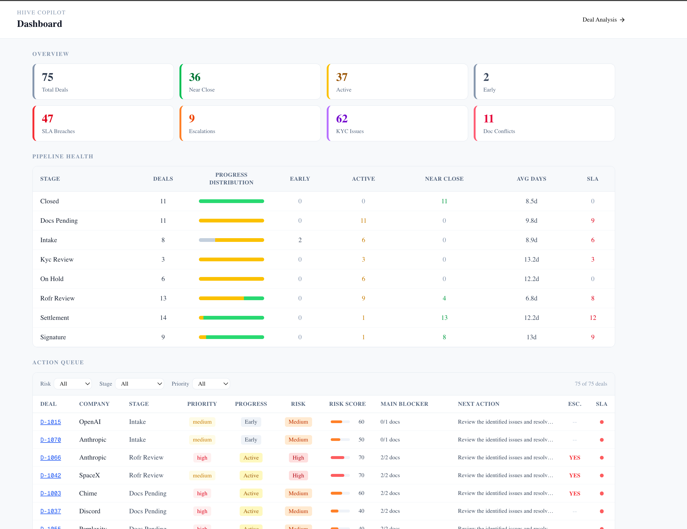
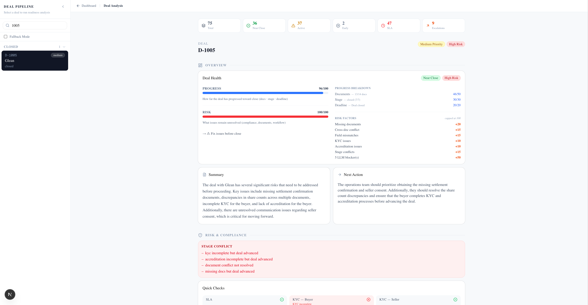
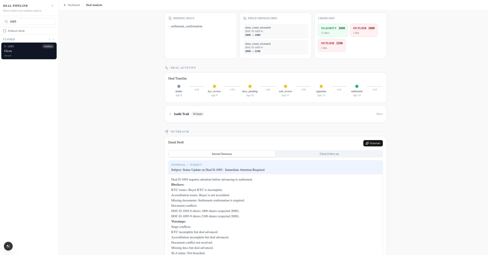

# Hiive Dealflow Copilot

> An AI copilot for transaction operations that surfaces hidden risks, missing steps, and next-best actions across the deal pipeline.

---

## 📊 Demo

👉 **[Watch Demo Video]([YOUR_YOUTUBE_LINK_HERE](https://youtu.be/Yi-BocTgGMI))**  
*(The system is not deployed publicly; this video demonstrates the full workflow.)*

---

## 🧠 Problem

Deal execution at Hiive is fragmented across:

- documents  
- communications  
- workflow systems  

As a result, teams often move deals forward without full visibility into:

- missing documents  
- unresolved compliance issues  
- cross-document inconsistencies  

This leads to delays, rework, and potential regulatory risk—especially in a high-volume, regulated environment.

---

## 🚀 What This Builds

A **Deal Pipeline Monitoring Copilot** for Transaction Services teams.

The system helps teams:

- Monitor pipeline progress and operational health  
- Detect hidden risks across documents, communications, and workflows  
- Prioritize deals through an action queue  
- Generate clear next actions and follow-ups  

---

## 🏗 Architecture



The system combines structured rule-based validation with LLM reasoning, unified through a deal-centric context layer.

---

## ⚙️ How It Works

The system follows a multi-stage pipeline aligned with real-world deal operations:

1. **Data Layer**  
   Aggregates deals, counterparties, documents, communications, notes, and workflow templates into a unified **DealContext**

2. **Analysis Layer**  
   - Rule engine → deterministic validation (documents, KYC, SLA, consistency)  
   - LLM → semantic reasoning over unstructured signals (blockers, summaries, next actions)

3. **Scoring Layer**  
   - **Risk Score** → measures unresolved issues and compliance exposure  
   - **Readiness Score** → measures progress toward closing  

4. **Action Layer**  
   - Escalation routing  
   - Recommended next actions  
   - Email generation  

---

## ⭐ Key Features

- Detects **false readiness** (deals that are advanced but still risky)  
- Surfaces **cross-document inconsistencies** with clear evidence  
- Prioritizes work via an **action queue**  
- Provides **explainable audit trails**  
- Generates **follow-up emails grounded in detected issues**  

---

## 📈 Product Views

### Overview



Shows overall pipeline health, including:
- Overview
- pipeline health signals (stage distribution, bottlenecks, SLA breaches)
- action queue with risk, stage, and priority filters

---

### Deal Analysis - Overview



Provides a high-level view of a single deal:
- progress vs. risk (readiness vs. unresolved issues)  
- key blockers and recommended next actions  
- stage-level context and escalation signals  

---

### Deal Analysis



Drills deeper into the same deal:
- missing documents and field mismatches  
- cross-document inconsistencies (majority vs. outliers)  
- timeline, audit trail, and generated follow-up email  
---

## 🧩 Design Principles

- **Rules + LLM (not LLM-only)** → ensures reliability and control  
- **Explainability first** → every decision is backed by evidence  
- **Progress ≠ Risk** → separates deal progression from unresolved issues  

---

## 🛠 Tech Stack

- **Backend**: FastAPI (Python 3.10), Pydantic, Uvicorn  
- **Frontend**: Next.js 15, React 19, TypeScript, Tailwind CSS v4, shadcn/ui  
- **LLM**: OpenAI GPT-4o-mini (analysis and email generation, with fallback)  
- **Data**: JSON flat files loaded in-memory  

---

## ▶️ Run Locally

### 1. Backend setup

```bash
# create Python environment
conda env create -f backend/environment.yml
conda activate hiive-copilot

# start backend (port 8000)
cd backend
uvicorn app.main:app --reload
```

### 2. Frontend setup

Open a new terminal:

```bash
cd frontend
npm install
npm run dev
```

### 3. Open the app

- Frontend: `http://localhost:3000`
- Backend docs: `http://localhost:8000/docs`

> Note: the backend and frontend have separate dependency environments.  
> The Conda environment only covers Python/backend dependencies; frontend packages must be installed with `npm install`.
---

## 📌 Notes

- This project is designed as a functional prototype for a Transaction Services workflow  
- The demo video showcases the full user flow, including dashboard navigation and deal-level analysis  
- All outputs are explainable and traceable, supporting use in regulated operational environments  